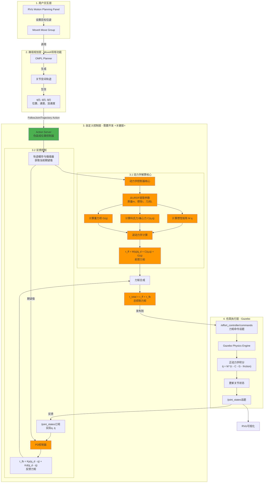

# ARV V1 机械臂力矩控制系统设计蓝图

> **项目目标**: 基于MoveIt路径规划，实现自定义动力学解算的力矩控制仿真系统
> 
> **创建时间**: 2025-10-28  
> **版本**: v1.0  
> **状态**: 规划阶段 🎯

---

## 📦 现有资源分析

### ARV_V1_MODEL 包
**描述**: 6自由度机械臂的完整URDF模型

✅ **机械结构**:
- 6个旋转关节 (joint_1 到 joint_6)
- 完整的运动学链: base_link → link6_2006roll

✅ **动力学参数**:
- 质量参数 (mass): 每个连杆的质量
- 惯性矩阵 (inertia): ixx, ixy, ixz, iyy, iyz, izz
- 几何形状 (meshes): STL网格文件
- 质心位置 (COM): xyz坐标

✅ **关节限制**:
- 力矩限制 (effort): 20 N·m
- 速度限制 (velocity): 10.47 rad/s
- 位置限制 (position): -3.14 ~ 3.14 rad

✅ **动力学特性**:
- 阻尼系数 (damping): 0.1
- 摩擦系数 (friction): 0.1

### ARV_V1_MOVEIT 包
**描述**: MoveIt运动规划配置

✅ **规划配置**:
- 规划组 "ARM": base_link → link6_2006roll
- 运动学求解器: KDL
- 路径规划器: OMPL (RRTConnect等)
- 预定义姿态: Escape, Start

✅ **控制接口**:
- 控制器: ARM_controller
- 当前类型: JointTrajectoryController
- 硬件接口: FakeSystem (需改为Gazebo)
- 状态接口: position, velocity

✅ **配置文件**:
- joint_limits.yaml: 关节限制
- kinematics.yaml: 运动学参数
- ros2_controllers.yaml: 控制器配置
- moveit_controllers.yaml: MoveIt控制器映射

---

## 🎯 系统架构设计

### ⚠️ **关键架构问题与解决方案**

#### **问题**: MoveIt要求位置控制接口，如何实现力矩控制？

**背景**:
- MoveIt的 `FollowJointTrajectory` action 默认期望**位置控制接口**
- MoveIt规划器只输出轨迹 `q(t), q̇(t), q̈(t)`，不涉及力矩
- 但我们想要自己编写动力学解算，实现**力矩控制**

**解决方案**: 分层控制架构 - **MoveIt不需要知道底层用的是力矩控制**

```
┌──────────────────────────────────────────────────────────┐
│  MoveIt层 (认为是位置控制)                                 │
│  • 规划轨迹 q(t)                                           │
│  • 发送 FollowJointTrajectory action                      │
│  • 不关心底层如何执行                                       │
└────────────────┬─────────────────────────────────────────┘
                 │ /ARM_controller/follow_joint_trajectory
                 ↓
┌──────────────────────────────────────────────────────────┐
│  你的控制器层 (Action Server + 力矩计算)                    │
│  • 接收轨迹，伪装成"位置控制器"                              │
│  • 内部进行动力学计算                                       │
│  • 输出力矩命令                                             │
└────────────────┬─────────────────────────────────────────┘
                 │ /effort_controller/commands (力矩)
                 ↓
┌──────────────────────────────────────────────────────────┐
│  Gazebo层 (真正的力矩执行)                                 │
│  • 接收力矩命令                                             │
│  • 物理引擎仿真                                             │
│  • 发布关节状态反馈                                         │
└──────────────────────────────────────────────────────────┘
```

**核心思想**:
1. **MoveIt视角**: 它以为自己在控制一个普通的位置控制器
2. **你的控制器**: 既是action server（接收轨迹），又是力矩计算器（输出力矩）
3. **Gazebo**: 只接收力矩命令，不管上层是什么

**优势**:
- ✅ 不需要修改MoveIt配置
- ✅ 可以完全控制动力学计算
- ✅ 架构清晰，模块解耦
- ✅ 便于调试和扩展

---

### 核心思路框图



### 控制器实现要点

**你的控制器节点需要同时扮演两个角色**:

```
┌─────────────────────────────────────────────────────────┐
│  TorqueControllerActionServer 节点                      │
├─────────────────────────────────────────────────────────┤
│                                                         │
│  角色1: Action Server (面向MoveIt)                       │
│  • 提供 /ARM_controller/follow_joint_trajectory         │
│  • 接收轨迹目标                                          │
│  • 发送执行反馈和结果                                     │
│  • MoveIt看到的是"正常的位置控制器"                       │
│                                                         │
│  角色2: 力矩控制器 (面向Gazebo)                          │
│  • 高频控制循环 (200-1000Hz)                            │
│  • 轨迹插值                                              │
│  • 动力学计算 (M, C, G)                                 │
│  • PD反馈控制                                            │
│  • 发布力矩命令到 /effort_controller/commands           │
│                                                         │
└─────────────────────────────────────────────────────────┘
```

**数据流向**:
```
MoveIt → Action Request → 你的节点 (缓存轨迹)
        ↑ Action Feedback ↲

控制循环 (高频):
  轨迹插值 → 期望状态 (q_d, q̇_d, q̈_d)
  ↓
  动力学计算 → 前馈力矩 (τ_ff)
  ↓
  PD控制 → 反馈力矩 (τ_fb)
  ↓
  合成 → 总力矩 (τ_total)
  ↓
  发布 → /effort_controller/commands → Gazebo
  ↑
  /joint_states ← Gazebo (状态反馈)
```

---

### 系统分层架构

```
┌─────────────────────────────────────────────────────────────────┐
│                  层次1: 现有功能 (不需要修改)                      │
├─────────────────────────────────────────────────────────────────┤
│ • ARV_V1_MODEL - URDF模型(质量、惯性、几何参数)                   │
│ • ARV_V1_MOVEIT - MoveIt规划器(OMPL生成轨迹)                     │
│ • RViz - 可视化界面                                               │
└─────────────────────────────────────────────────────────────────┘
                              ↓
┌─────────────────────────────────────────────────────────────────┐
│                  层次2: 需要新建的包 (核心开发)                    │
├─────────────────────────────────────────────────────────────────┤
│  📦 arv_dynamics_controller                                     │
│     ├── src/                                                    │
│     │   ├── urdf_dynamics_parser.cpp      # URDF参数提取        │
│     │   ├── dynamics_solver.cpp           # 动力学计算          │
│     │   ├── inverse_dynamics_controller.cpp # 逆动力学控制      │
│     │   └── torque_controller_node.cpp    # 主控制节点          │
│     ├── include/                                                │
│     │   └── arv_dynamics_controller/                            │
│     │       ├── dynamics_params.hpp       # 动力学参数结构      │
│     │       └── controller_base.hpp       # 控制器基类          │
│     ├── config/                                                 │
│     │   └── controller_params.yaml        # 控制器参数配置      │
│     └── launch/                                                 │
│         └── torque_control.launch.py      # 启动文件            │
└─────────────────────────────────────────────────────────────────┘
                              ↓
┌─────────────────────────────────────────────────────────────────┐
│                  层次3: 需要修改的配置 (配置调整)                  │
├─────────────────────────────────────────────────────────────────┤
│ • ARV_V1_MODEL.ros2_control.xacro - 改为effort接口               │
│ • ros2_controllers.yaml - 配置effort_controllers                │
│ • moveit_controllers.yaml - 更新控制器映射                       │
│ • demo.launch.py - 集成Gazebo和新控制器                         │
└─────────────────────────────────────────────────────────────────┘
                              ↓
┌─────────────────────────────────────────────────────────────────┐
│                  层次4: 仿真环境 (Gazebo)                         │
├─────────────────────────────────────────────────────────────────┤
│ • Gazebo物理引擎 - 正动力学仿真                                   │
│ • gazebo_ros2_control - 硬件接口                                │
│ • effort_controllers - 力矩控制器                                │
└─────────────────────────────────────────────────────────────────┘
```

---

## 📊 数据流详解

### 1️⃣ MoveIt规划输出 → 自定义控制器输入

**接口类型**: Action Server  
**Action名称**: `/ARM_controller/follow_joint_trajectory`  
**消息类型**: `control_msgs/action/FollowJointTrajectory`

```yaml
数据结构:
  trajectory:
    joint_names: [joint_1, joint_2, joint_3, joint_4, joint_5, joint_6]
    points:
      - time_from_start: 0.0s
        positions: [q1, q2, q3, q4, q5, q6]
        velocities: [q̇1, q̇2, q̇3, q̇4, q̇5, q̇6]
        accelerations: [q̈1, q̈2, q̈3, q̈4, q̈5, q̈6]
      - time_from_start: 0.1s
        positions: [...]
        velocities: [...]
        accelerations: [...]
      - ...
```

**你的控制器需要做的**:
- ✅ **提供Action Server** - MoveIt会连接这个action
- ✅ **接收轨迹** - 缓存整条轨迹
- ✅ **实时插值** - 获取当前时刻的 `q_d(t)`, `q̇_d(t)`, `q̈_d(t)`
- ✅ **发送反馈** - 周期性发送执行进度、误差等
- ✅ **返回结果** - 轨迹执行成功/失败状态

**关键点**: MoveIt不知道你内部用力矩控制，它只关心action能否成功执行

### 2️⃣ 动力学计算公式

**机器人动力学方程**:
```
τ = M(q)·q̈ + C(q,q̇)·q̇ + G(q) + F_friction
```

**各项含义**:
- `M(q) ∈ ℝ⁶ˣ⁶`: 惯性矩阵 (从URDF的inertia参数计算)
- `C(q,q̇) ∈ ℝ⁶ˣ⁶`: 科氏力和离心力矩阵
- `G(q) ∈ ℝ⁶`: 重力项 (质量 × 重力加速度 × 几何关系)
- `F_friction`: 摩擦力 (URDF中的damping和friction参数)

**控制律设计**:
```
τ_total = τ_feedforward + τ_feedback

前馈项 (补偿动力学):
  τ_ff = M(q)·q̈_desired + C(q,q̇)·q̇ + G(q)

反馈项 (跟踪误差):
  τ_fb = Kp·(q_desired - q_actual) + Kd·(q̇_desired - q̇_actual)
```

**参数来源**:
- 质量 `m`: URDF `<mass value="..."/>`
- 惯性 `I`: URDF `<inertia ixx="..." ixy="..." .../>`
- 几何 `L`: URDF `<origin xyz="..." rpy="..."/>`
- 重力 `g`: 9.81 m/s² (z轴负方向)

### 3️⃣ 自定义控制器输出 → Gazebo输入

**话题**: `/effort_controller/commands`  
**消息类型**: `std_msgs/Float64MultiArray`

```yaml
数据: [τ1, τ2, τ3, τ4, τ5, τ6]  # 6个关节的力矩命令

约束条件:
  - |τi| ≤ 20 N·m  (URDF中定义的effort limit)
  - 发布频率: ≥100 Hz (推荐200-1000Hz)
```

### 4️⃣ Gazebo反馈 → 自定义控制器

**话题**: `/joint_states`  
**消息类型**: `sensor_msgs/JointState`

```yaml
数据结构:
  header:
    stamp: 当前时间戳
  name: [joint_1, joint_2, joint_3, joint_4, joint_5, joint_6]
  position: [q1, q2, q3, q4, q5, q6]      # 实际位置 [rad]
  velocity: [q̇1, q̇2, q̇3, q̇4, q̇5, q̇6]    # 实际速度 [rad/s]
  effort: [τ1, τ2, τ3, τ4, τ5, τ6]        # 实际力矩 [N·m] (可选)
```

---

## 🛠️ 实施路线图

### 阶段0: 配置修改 (1-2天) ⚙️

#### **核心配置策略**

**关键理解**: 
- MoveIt配置保持不变（它认为是位置控制）
- Gazebo配置使用effort接口（真正的力矩控制）
- 你的控制器在中间做转换

---

**修改1**: `ARV_V1_MODEL.ros2_control.xacro` - 硬件接口

```xml
<!-- 当前配置 (位置控制) -->
<joint name="joint_1">
    <command_interface name="position"/>
    <state_interface name="position"/>
    <state_interface name="velocity"/>
</joint>

<!-- 修改为 (力矩控制) -->
<joint name="joint_1">
    <command_interface name="effort"/>  <!-- ← 改为effort -->
    <state_interface name="position"/>
    <state_interface name="velocity"/>
    <state_interface name="effort"/>
</joint>
```

**说明**: 6个关节都需要同样修改

---

**修改2**: `ARV_V1_MOVEIT/config/ros2_controllers.yaml` - Gazebo端控制器

```yaml
controller_manager:
  ros__parameters:
    update_rate: 100  # Hz
    
    # Gazebo端的effort控制器（只接收力矩命令）
    effort_controller:
      type: effort_controllers/JointGroupEffortController
    
    joint_state_broadcaster:
      type: joint_state_broadcaster/JointStateBroadcaster

effort_controller:
  ros__parameters:
    joints:
      - joint_1
      - joint_2
      - joint_3
      - joint_4
      - joint_5
      - joint_6
    interface_name: effort  # 关键: 使用effort接口
```

**说明**: 这个控制器只是转发力矩命令到Gazebo，不做任何计算

---

**修改3**: `ARV_V1_MOVEIT/config/moveit_controllers.yaml` - MoveIt配置

```yaml
# 保持不变！MoveIt不知道底层用力矩
moveit_controller_manager: moveit_simple_controller_manager/MoveItSimpleControllerManager

moveit_simple_controller_manager:
  controller_names:
    - ARM_controller  # ← 这个名字对应你的action server

  ARM_controller:
    type: FollowJointTrajectory  # MoveIt期望的类型
    action_ns: follow_joint_trajectory
    default: true
    joints:
      - joint_1
      - joint_2
      - joint_3
      - joint_4
      - joint_5
      - joint_6
```

**说明**: MoveIt会连接到 `/ARM_controller/follow_joint_trajectory` action，由你的节点提供

---

**任务清单**:
- [ ] 修改所有6个关节的command_interface为effort
- [ ] 配置effort_controller（Gazebo端）
- [ ] 确认moveit_controllers.yaml指向正确的action名称
- [ ] 测试配置文件语法
- [ ] 理解三层配置的关系

---

### 阶段1: 创建新包 (1天) 📦

**命令**:
```bash
cd ~/ros2_ws/src
ros2 pkg create arv_dynamics_controller \
  --build-type ament_cmake \
  --dependencies \
    rclcpp \
    rclcpp_action \
    std_msgs \
    sensor_msgs \
    control_msgs \
    trajectory_msgs \
    urdf \
    kdl_parser \
    orocos_kdl \
    eigen3_cmake_module
```

**目录结构**:
```
arv_dynamics_controller/
├── CMakeLists.txt
├── package.xml
├── include/arv_dynamics_controller/
│   ├── dynamics_params.hpp
│   ├── urdf_parser.hpp
│   ├── dynamics_solver.hpp
│   └── torque_controller_action_server.hpp  # Action Server类
├── src/
│   ├── urdf_parser.cpp
│   ├── dynamics_solver.cpp
│   ├── torque_controller_action_server.cpp  # Action Server实现
│   └── main.cpp  # 主节点
├── config/
│   └── controller_params.yaml
└── launch/
    └── torque_control.launch.py
```

**任务清单**:
- [ ] 创建包和目录结构
- [ ] 配置CMakeLists.txt依赖
- [ ] 配置package.xml
- [ ] 创建头文件框架

---

### 阶段2: URDF参数提取 (2-3天) 🔍

**目标**: 从URDF中提取6个关节的运动链和动力学参数

**实现文件**: 
- 📄 `ARV_V1_MOVEIT/src/urdf_parser.cpp` - 完整实现
- 📄 `ARV_V1_MOVEIT/test_urdf_parser.cpp` - 测试程序
- 📄 `ARV_V1_MOVEIT/build_test.sh` - 编译脚本

#### **核心功能**

```cpp
class URDFDynamicsParser {
public:
    // 关键方法1: 解析URDF文件
    bool parseURDF(const std::string& urdf_path);
    
    // 关键方法2: 解析URDF字符串（ROS节点中使用）
    bool parseURDFString(const std::string& urdf_string);
    
    // 关键方法3: 获取KDL运动链（最重要！）
    KDL::Chain getKDLChain() const;
    
    // 辅助方法: 获取有序的参数列表
    std::vector<LinkDynamics> getLinkDynamics() const;
    std::vector<JointInfo> getJointInfo() const;
};
```

#### **运动链提取原理**

```
你的URDF结构:
  base_link (固定)
    ↓ joint_1
  link1_double8009 (质量: 0.208kg, 惯性: ...)
    ↓ joint_2
  link2_arm1
    ↓ joint_3
  link3_sight
    ↓ joint_4
  link4_arm2
    ↓ joint_5
  link5_4310pitch
    ↓ joint_6
  link6_2006roll

KDL解析后:
  KDL::Chain chain;
  chain.getNrOfJoints()    → 6
  chain.getNrOfSegments()  → 7 (包括base)
  
自动包含:
  ✅ 每个连杆的质量、惯性、质心
  ✅ 每个关节的轴方向、限制
  ✅ 正确的运动学顺序
```

#### **测试步骤**

````bash
# 1. 进入目录
cd /home/huan/ros2_ws/src/ARV_V1_MOVEIT

# 2. 编译测试程序
chmod +x build_test.sh
./build_test.sh

# 输出示例:
# ✅ Successfully loaded URDF: ARV_V1_MODEL
# ✅ KDL chain extracted: 7 segments, 6 joints
# 📊 Extracted 6 joints and 6 links
# 
# 【KDL运动链】
#   Segments: 7
#   Joints:   6
# 
# 【关节信息】(6 个)
#   [1] joint_1 | 类型: revolute | 轴: (0,0,1) | 力矩限制: 20 N·m | 阻尼: 0.1
#   [2] joint_2 | ...
#   ...
````

#### **关键点说明**

**为什么使用KDL解析器？**
1. ✅ **自动排序** - KDL会按运动学链的顺序排列关节
2. ✅ **参数完整** - 自动提取所有URDF中的动力学参数
3. ✅ **久经考验** - ROS社区广泛使用，稳定可靠
4. ✅ **直接可用** - 返回的 `KDL::Chain` 可直接用于动力学计算

**数据流**:
```
ARV_V1_MODEL.urdf
    ↓ URDFDynamicsParser::parseURDF()
    ↓ kdl_parser::treeFromFile()
    ↓ tree.getChain("base_link", "link6_2006roll")
KDL::Chain (6个关节，按正确顺序)
```
// 从你的URDF提取的实际数据
LinkDynamics link1 = {
    .name = "link1_double8009",
    .mass = 0.208,  // kg
    .com = {-0.00015, 0.00019, 0.04186},  // m
    .inertia = {
        {0.00032, -1.2e-9, -6.9e-9},
        {-1.2e-9, 0.00032, -1.0e-8},
        {-6.9e-9, -1.0e-8, 0.00011}
    }
};
```

**任务清单**:
- [ ] 解析URDF文件
- [ ] 提取所有连杆的mass、inertia、COM
- [ ] 提取所有关节的axis、limits、dynamics
- [ ] 创建KDL::Chain对象
- [ ] 单元测试参数提取

---

### 阶段3: 动力学计算 (1-2周) ⚠️ **最复杂部分**

**选项A: 使用KDL库 (推荐)** ✅

```cpp
#include <kdl/chaindynparam.hpp>

class DynamicsSolver {
private:
    KDL::Chain chain_;
    KDL::ChainDynParam* dyn_solver_;
    KDL::Vector gravity_;
    
public:
    DynamicsSolver(const KDL::Chain& chain) {
        chain_ = chain;
        gravity_ = KDL::Vector(0, 0, -9.81);
        dyn_solver_ = new KDL::ChainDynParam(chain_, gravity_);
    }
    
    // 计算惯性矩阵 M(q)
    void computeMassMatrix(
        const KDL::JntArray& q,
        KDL::JntSpaceInertiaMatrix& M
    ) {
        dyn_solver_->JntToMass(q, M);
    }
    
    // 计算科氏力和离心力 C(q,q̇)
    void computeCoriolisMatrix(
        const KDL::JntArray& q,
        const KDL::JntArray& q_dot,
        KDL::JntArray& C
    ) {
        dyn_solver_->JntToCoriolis(q, q_dot, C);
    }
    
    // 计算重力项 G(q)
    void computeGravity(
        const KDL::JntArray& q,
        KDL::JntArray& G
    ) {
        dyn_solver_->JntToGravity(q, G);
    }
    
    // 逆动力学: τ = M(q)q̈ + C(q,q̇) + G(q)
    void computeInverseDynamics(
        const KDL::JntArray& q,
        const KDL::JntArray& q_dot,
        const KDL::JntArray& q_ddot,
        KDL::JntArray& torques
    ) {
        KDL::JntSpaceInertiaMatrix M(6);
        KDL::JntArray C(6), G(6);
        
        computeMassMatrix(q, M);
        computeCoriolisMatrix(q, q_dot, C);
        computeGravity(q, G);
        
        // τ = M*q̈ + C + G
        for (int i = 0; i < 6; i++) {
            torques(i) = G(i) + C(i);
            for (int j = 0; j < 6; j++) {
                torques(i) += M(i, j) * q_ddot(j);
            }
        }
    }
};
```

**选项B: 手写递归牛顿-欧拉算法** (高级)

```cpp
// 仅框架示例
class RecursiveNEDynamics {
    // 前向递归: 计算速度和加速度
    void forwardRecursion(/* ... */);
    
    // 后向递归: 计算力和力矩
    void backwardRecursion(/* ... */);
    
    // 逆动力学
    void inverseDynamics(/* ... */);
};
```

**任务清单**:
- [ ] 安装和配置KDL库
- [ ] 实现动力学计算接口
- [ ] 编写单元测试
- [ ] 性能基准测试 (目标: <1ms/次)
- [ ] 验证计算精度

---

### 阶段4: 控制器节点 (1周) 🎛️

**核心组件**: Action Server + 高频控制循环

#### **节点架构要点**

```
TorqueControllerActionServer 节点
├── Action Server 接口 (面向MoveIt)
│   ├── 接收轨迹目标
│   ├── 缓存轨迹数据
│   ├── 发送执行反馈
│   └── 返回执行结果
│
├── 高频控制循环 (200-1000Hz)
│   ├── 轨迹插值 → q_d(t), q̇_d(t), q̈_d(t)
│   ├── 动力学计算 → τ_ff
│   ├── PD反馈 → τ_fb
│   └── 力矩发布 → /effort_controller/commands
│
└── 状态订阅
    └── /joint_states → q_actual, q̇_actual
```

#### **关键实现点**

**1. Action Server功能**
- 提供 `/ARM_controller/follow_joint_trajectory` action
- 接收MoveIt发来的轨迹
- 周期性发送反馈 (位置误差、执行进度)
- 轨迹完成后返回成功/失败状态

**2. 轨迹管理**
- 缓存整条轨迹
- 记录开始时间
- 实时插值当前期望状态

**3. 控制循环**
- 高频定时器 (5-10ms周期)
- 计算前馈力矩: `τ_ff = M(q)q̈_d + C(q,q̇) + G(q)`
- 计算反馈力矩: `τ_fb = Kp·(q_d - q) + Kd·(q̇_d - q̇)`
- 合成并限幅: `τ_total = clamp(τ_ff + τ_fb, -20, 20)`

**4. 状态反馈**
- 订阅 `/joint_states`
- 提取当前位置和速度
- 用于PD控制和误差计算

#### **配置文件**: `config/controller_params.yaml`

```yaml
torque_controller:
  ros__parameters:
    # 控制频率
    control_rate: 200  # Hz (建议200-1000)
    
    # PD增益 (需要调优)
    Kp: [100.0, 100.0, 100.0, 50.0, 50.0, 50.0]
    Kd: [10.0, 10.0, 10.0, 5.0, 5.0, 5.0]
    
    # 力矩限制
    torque_limit: 20.0  # N·m
    
    # URDF路径
    robot_description: "robot_description"  # 从参数服务器获取
```

**任务清单**:
- [ ] 实现Action Server接口
- [ ] 实现轨迹缓存和插值
- [ ] 实现关节状态反馈
- [ ] 集成动力学计算
- [ ] 实现PD控制
- [ ] 实现高频控制循环
- [ ] 添加安全检查和限幅
- [ ] 编写参数配置文件
- [ ] 测试action连接和执行
- [ ] 实现关节状态反馈
- [ ] 集成动力学计算
- [ ] 实现PD控制
- [ ] 添加安全检查和限幅
- [ ] 编写参数配置文件
- [ ] 测试控制循环稳定性

---

### 阶段5: Gazebo集成 (3-5天) 🌐

**创建launch文件**: `launch/torque_control_gazebo.launch.py`

#### **Launch文件关键组件**

```python
def generate_launch_description():
    # 包路径
    moveit_config_pkg = get_package_share_directory('ARV_V1_MOVEIT')
    gazebo_ros_pkg = get_package_share_directory('gazebo_ros')
    controller_pkg = get_package_share_directory('arv_dynamics_controller')
    
    return LaunchDescription([
        # 1. Gazebo仿真环境
        gazebo_launch,
        
        # 2. 生成并加载机器人
        spawn_entity_node,
        
        # 3. ros2_control节点（管理Gazebo端的effort_controller）
        ros2_control_node,
        
        # 4. 加载Gazebo端的effort控制器
        load_effort_controller,
        
        # 5. 加载joint_state_broadcaster
        load_joint_state_broadcaster,
        
        # 6. ⭐你的力矩控制器（Action Server + 动力学计算）⭐
        torque_controller_action_server,
        
        # 7. MoveIt move_group（连接到你的action server）
        moveit_launch,
        
        # 8. RViz可视化
        rviz_launch
    ])
```

#### **关键点**

**启动顺序很重要**:
1. Gazebo先启动
2. 加载机器人模型
3. 启动ros2_control和effort_controller
4. 启动你的力矩控制器（提供action server）
5. 最后启动MoveIt（连接action server）

**话题连接关系**:
```
MoveIt → /ARM_controller/follow_joint_trajectory (action) → 你的节点
你的节点 → /effort_controller/commands (topic) → Gazebo
Gazebo → /joint_states (topic) → 你的节点 + MoveIt + RViz
```

**任务清单**:
- [ ] 配置Gazebo世界文件
- [ ] 设置gazebo_ros2_control插件
- [ ] 创建完整launch文件
- [ ] 测试Gazebo加载和物理仿真
- [ ] 验证effort接口工作
- [ ] 确认所有话题正确连接
- [ ] 测试action server可被MoveIt发现

---

### 阶段6: 调试优化 (1-2周) 🔧

**调试步骤**:

1. **单关节测试**
   ```bash
   # 测试单个关节的力矩响应
   ros2 topic pub /effort_controller/commands std_msgs/Float64MultiArray \
     "data: [1.0, 0.0, 0.0, 0.0, 0.0, 0.0]"
   ```

2. **重力补偿测试**
   ```bash
   # 验证重力项计算是否正确
   # 机器人应该能够"悬浮"在当前位置
   ```

3. **轨迹跟踪测试**
   ```bash
   # 使用MoveIt规划简单轨迹
   # 观察跟踪误差
   ```

4. **参数调优**
   - 使用`rqt_reconfigure`动态调整Kp, Kd
   - 使用`PlotJuggler`可视化误差曲线
   - 记录最优参数

**性能指标**:
- [ ] 控制循环频率 ≥100 Hz
- [ ] 位置跟踪误差 <0.01 rad
- [ ] 速度跟踪误差 <0.1 rad/s
- [ ] 无振荡和超调
- [ ] 稳定运行 >10分钟

**调试工具**:
```bash
# 查看话题列表
ros2 topic list

# 监控关节状态
ros2 topic echo /joint_states

# 监控力矩命令
ros2 topic echo /effort_controller/commands

# 检查TF树
ros2 run tf2_tools view_frames

# 可视化数据
ros2 run plotjuggler plotjuggler
```

---

## ⚡ 可行性与风险评估

### 技术可行性矩阵

| 方面 | 评分 | 说明 | 风险等级 |
|------|------|------|---------|
| **URDF完整性** | ⭐⭐⭐⭐⭐ | 包含完整动力学参数 | 🟢 低 |
| **动力学计算** | ⭐⭐⭐⭐☆ | KDL库成熟可靠 | 🟡 中 |
| **实时性** | ⭐⭐⭐☆☆ | 需要优化计算效率 | 🟡 中 |
| **控制稳定性** | ⭐⭐⭐☆☆ | 需要仔细调参 | 🟡 中 |
| **Gazebo集成** | ⭐⭐⭐⭐☆ | 官方支持良好 | 🟢 低 |
| **MoveIt兼容** | ⭐⭐⭐⭐⭐ | 现有配置完善 | 🟢 低 |

### 优势 ✅

1. **完整的动力学模型**
   - URDF包含所有必要参数 (质量、惯性、几何)
   - 不需要额外的参数辨识

2. **成熟的工具链**
   - MoveIt提供路径规划
   - KDL提供动力学计算
   - Gazebo提供物理仿真

3. **灵活的架构**
   - 模块化设计，易于调试
   - 可以逐步开发和测试
   - 便于后续扩展 (如添加力控、阻抗控制)

4. **教育价值**
   - 深入理解机器人动力学
   - 掌握控制系统设计
   - 积累实际项目经验

### 挑战与对策 ⚠️

| 挑战 | 影响 | 对策 |
|------|------|------|
| 动力学计算复杂 | 开发时间长 | 使用KDL库，避免重复造轮子 |
| 实时性要求高 | 控制性能 | 优化代码，使用C++，避免不必要的拷贝 |
| 参数调优困难 | 控制效果 | 从简单场景开始，逐步增加复杂度 |
| Gazebo仿真精度 | 真实性 | 仔细设置摩擦、阻尼等参数 |
| 调试困难 | 开发效率 | 使用日志、可视化工具，单元测试 |

### 时间估算

```
总计: 4-7周 (取决于经验和投入时间)

┌─────────────────────┬─────────┬─────────────┐
│ 阶段                │ 预计    │ 关键里程碑    │
├─────────────────────┼─────────┼─────────────┤
│ 0. 配置修改         │ 1-2天   │ effort接口  │
│ 1. 创建包           │ 1天     │ 目录结构    │
│ 2. URDF解析         │ 2-3天   │ 参数提取    │
│ 3. 动力学计算       │ 1-2周   │ 逆动力学    │
│ 4. 控制器节点       │ 1周     │ 控制循环    │
│ 5. Gazebo集成       │ 3-5天   │ 仿真运行    │
│ 6. 调试优化         │ 1-2周   │ 稳定跟踪    │
└─────────────────────┴─────────┴─────────────┘
```

---

## 🎯 开发路径建议

### 推荐的迭代开发流程

```
第1周: 环境搭建与基础测试
  ├── 修改ros2_control配置
  ├── 创建新包和基础框架
  └── 测试Gazebo加载和effort接口

第2周: URDF解析与KDL集成
  ├── 实现URDF参数提取
  ├── 配置KDL库
  └── 验证动力学参数

第3周: 动力学计算实现
  ├── 实现M, C, G计算
  ├── 单元测试动力学函数
  └── 性能基准测试

第4周: 简单控制器实现
  ├── 实现重力补偿控制
  ├── 测试单关节响应
  └── 添加PD反馈

第5周: 轨迹跟踪集成
  ├── 连接MoveIt规划器
  ├── 实现轨迹插值
  └── 测试简单运动

第6周: 完整系统测试
  ├── 全关节联合测试
  ├── 复杂轨迹跟踪
  └── 初步参数调优

第7周: 优化与文档 (可选)
  ├── 性能优化
  ├── 稳定性测试
  └── 编写使用文档
```

### 每周目标检查点 ✓

**Week 1**: 
- [ ] Gazebo能加载机器人
- [ ] 能发布effort命令并看到响应

**Week 2**:
- [ ] 能从URDF提取所有动力学参数
- [ ] KDL chain构建成功

**Week 3**:
- [ ] 能计算M, C, G矩阵
- [ ] 逆动力学计算正确

**Week 4**:
- [ ] 重力补偿工作正常
- [ ] 单关节PD控制稳定

**Week 5**:
- [ ] 能接收MoveIt轨迹
- [ ] 基本轨迹跟踪能工作

**Week 6**:
- [ ] 6关节联合运动流畅
- [ ] 跟踪误差在可接受范围

---

## 📚 参考资源

### 技术文档
- [KDL Documentation](https://www.orocos.org/kdl.html)
- [ros2_control Documentation](https://control.ros.org/)
- [Gazebo Tutorials](http://gazebosim.org/tutorials)
- [MoveIt2 Documentation](https://moveit.picknik.ai/)

### 理论基础
- 《Robotics: Modelling, Planning and Control》- Siciliano
- 《Modern Robotics》- Lynch & Park
- 《Springer Handbook of Robotics》

### 代码参考
- [ros2_control demos](https://github.com/ros-controls/ros2_control_demos)
- [MoveIt servo](https://github.com/moveit/moveit2/tree/main/moveit_ros/moveit_servo)

---

## 📝 开发日志

### 版本历史

| 版本 | 日期 | 变更说明 | 作者 |
|------|------|---------|------|
| v1.0 | 2025-10-28 | 初始规划文档创建 | - |
| - | - | - | - |

### 待解决问题

- [ ] 确定具体的控制频率 (100Hz vs 200Hz vs 1000Hz)
- [ ] 选择动力学库 (KDL vs Pinocchio vs 手写)
- [ ] 确定参数调优策略
- [ ] 考虑是否添加前馈摩擦补偿

### 扩展功能规划 (未来)

- [ ] 添加力/力矩传感器仿真
- [ ] 实现阻抗控制
- [ ] 添加碰撞检测与安全限制
- [ ] 支持实时轨迹修改
- [ ] 集成机器学习优化控制参数

---

## 🚀 快速开始指南

### 前提条件检查

```bash
# 检查ROS2安装
ros2 --version

# 检查Gazebo安装
gazebo --version

# 检查MoveIt安装
ros2 pkg list | grep moveit

# 检查KDL安装
dpkg -l | grep kdl
```

### 安装依赖

```bash
# 安装KDL和相关库
sudo apt install ros-jazzy-orocos-kdl \
                 ros-jazzy-kdl-parser \
                 ros-jazzy-python-orocos-kdl \
                 libeigen3-dev

# 安装Gazebo相关
sudo apt install ros-jazzy-gazebo-ros2-control \
                 ros-jazzy-gazebo-ros-pkgs

# 安装控制器
sudo apt install ros-jazzy-ros2-control \
                 ros-jazzy-ros2-controllers \
                 ros-jazzy-effort-controllers
```

### 第一步: 测试现有系统

```bash
# 1. 构建工作空间
cd ~/ros2_ws
colcon build
source install/setup.bash

# 2. 启动MoveIt demo (验证当前配置)
ros2 launch ARV_V1_MOVEIT demo.launch.py

# 3. 在RViz中测试路径规划
# 应该能看到机器人模型并能规划轨迹
```

---

**文档状态**: 🟢 活跃开发  
**最后更新**: 2025-10-28  
**维护者**: -  

---

> 💡 **提示**: 这是一个迭代文档，随着项目进展会持续更新。建议每完成一个阶段就更新相应的状态和经验总结。